<!--
  RENAMEKK // DEEP-SPACE PROFILE
  Every scene is a self-hosted, responsive, pure-SVG animation.
-->

<!-- HERO // IDENTITY -->

 
 

 

<!-- SECTOR 02 // TECHNOLOGIES -->

 

<!-- SECTOR 03 // SYSTEM MAP -->

 

<!-- OPEN CHANNELS -->

 

 

 
 

